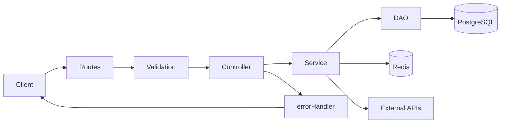

# Knowledge Transfer (KT) — Trabuwo Backend

This document is the single source of truth for understanding, running, and extending the Trabuwo backend. It complements the [README](../README.md) (quick start and env) by focusing on **architecture, conventions, and how things work**.

---

## 1. Project overview

**What it is**: Node.js/Express REST API for the Trabuwo ecommerce marketplace, serving buyers, sellers, and admins.

**Tech stack**:

- **Runtime**: Node.js(v22.18.0)
- **Framework**: Express 5
- **Database**: PostgreSQL with Sequelize ORM
- **Cache**: Redis (sessions, Shiprocket token, etc.)
- **Auth**: JWT with role-based access (admin, buyer, seller)
- **API docs**: Swagger/OpenAPI (swagger-jsdoc, swagger-ui-express)
- **Logging**: Winston with request correlation
- **Config**: `config` package (defaults + env mapping)

**External services**: AWS S3 (uploads), Razorpay (payments), Shiprocket (logistics), MSG91 (SMS/notifications), GST verification API; optional OpenTelemetry for observability.

For concrete dependency versions and config keys, see [package.json](../package.json) and [config/default.json](../config/default.json).

---

## 2. High-level architecture

### Request flow



### Layers

| Layer          | Location                                      | Responsibility                                                                                                           |
| -------------- | --------------------------------------------- | ------------------------------------------------------------------------------------------------------------------------ |
| **Routes**     | [src/routes/index.js](../src/routes/index.js) | Mount module routers under `/api/*`; wire auth middleware; Swagger is documented in each module’s `routes.js`.           |
| **Validation** | Each module’s `validation.js`                 | express-validator chains per route. Input is validated here only; no duplicate checks in service/controller/dao.         |
| **Controller** | Each module’s `controller.js`                 | Thin layer: uses `asyncHandler`, calls service, returns via `apiResponse` or lets domain errors propagate.               |
| **Service**    | Each module’s `service.js`                    | Business logic; throws domain errors from [src/utils/errors.js](../src/utils/errors.js); uses DAO and external services. |
| **DAO**        | Each module’s `dao.js`                        | All DB access (Sequelize); batch/join/bulk patterns; no business logic.                                                  |

**Special routes**: In [src/app.js](../src/app.js), `POST /webhook` (Razorpay) and `POST /logistics-webhook` (Shiprocket) use raw body parsing and are registered before `express.json()`, so webhook signatures can be verified correctly.

---

## 3. Project structure

### Directory map (`src/`)

| Path          | Purpose                                                                                                                     |
| ------------- | --------------------------------------------------------------------------------------------------------------------------- |
| `app.js`      | Bootstrap: middleware order, health check, graceful shutdown, DB/Redis/Graphile Worker startup.                             |
| `config/`     | database, redis, logger, swagger, graphileWorker, telemetry.                                                                |
| `middleware/` | auth (JWT, roles), errorHandler (centralized error → HTTP response).                                                        |
| `modules/`    | One folder per domain (e.g. product, order, auth, payment).                                                                 |
| `services/`   | Shared infra: S3, graphileWorkerService, redis.                                                                             |
| `tasks/`      | Graphile task handlers (e.g. stock notifications, view flush).                                                              |
| `jobs/`       | Job configs for recurring tasks (cron, retries) consumed by Graphile.                                                       |
| `utils/`      | asyncHandler, ApiError, errors, apiResponse, axiosError, validation helpers, encryption, imageProcessor, excelService, etc. |

### Module layout

Each domain module follows the same pattern:

- **Required**: `model.js`, `dao.js`, `service.js`, `controller.js`, `routes.js`, `validation.js`
- **Optional**: `helper.js`, `constants.js`

Use [src/modules/product](../src/modules/product) or [src/modules/cart](../src/modules/cart) as a reference when adding or reading a module.

---

## 4. Conventions and patterns

These align with [.cursor/rules/follow-existing-patterns.mdc](../.cursor/rules/follow-existing-patterns.mdc).

**Errors**

- Use domain errors from [src/utils/errors.js](../src/utils/errors.js) (ValidationError, NotFoundError, AuthenticationError, ConflictError, ResourceCreationError, ExternalServiceError, etc.).
- Only [src/middleware/errorHandler.js](../src/middleware/errorHandler.js) catches errors and maps them to HTTP status and JSON. Do not add try/catch in new modules except when calling third-party APIs.
- For third-party API calls, use [src/utils/axiosError.js](../src/utils/axiosError.js) and domain-specific `ExternalServiceError` subclasses (e.g. ShiprocketError, Msg91Error).

**Responses**

- Use an explicit allow-list of fields in API responses. Use `apiResponse` and `ApiError.send`; never expose passwords, tokens, internal IDs, or unnecessary audit fields unless required by the frontend.

**IDs**

- `id`: internal integer primary key.
- `publicId`: UUID v7 for all client-facing endpoints (use in URLs and responses). Some admin routes may use internal IDs.

**Models (Sequelize)**

- Property names: `camelCase` in code.
- Table names: `snake_case` with `underscored: true`.
- Every model has `publicId` (UUID v7).

**Transactions**

- Use only when multiple DB operations must be atomic. Use `sequelize.transaction(async (t) => { ... })`; rollback is handled by Sequelize, so no manual try/catch for rollback.

### Code snippets

**Throwing NotFoundError (service):**

```js
const { NotFoundError } = require("../../utils/errors");

if (!entity) throw new NotFoundError("Product not found", { publicId });
```

**Route with asyncHandler (routes):**

```js
const asyncHandler = require("../../utils/asyncHandler");

router.get(
  "/:publicId",
  validation.getByPublicId,
  asyncHandler(controller.getByPublicId),
);
```

**Transaction (service/dao):**

```js
const sequelize = require("../../config/database");

return await sequelize.transaction(async (t) => {
  const created = await dao.create(data, { transaction: t });
  await dao.updateRelated(created.id, related, { transaction: t });
  return created;
});
```

---

## 5. Shared utilities and middleware

| File                           | Purpose                                                                                                                                                                                                                                                    |
| ------------------------------ | ---------------------------------------------------------------------------------------------------------------------------------------------------------------------------------------------------------------------------------------------------------- |
| **utils/errors.js**            | Domain error classes: AppError, ValidationError, AuthenticationError, NotFoundError, ConflictError, ResourceCreationError, ExternalServiceError, DatabaseError, Msg91Error, ShiprocketError. Throw these in service layer; errorHandler maps them to HTTP. |
| **utils/ApiError.js**          | `ApiError(status, message, code, details)` and `ApiError.send(res, error)`; used by errorHandler and occasionally in middleware (e.g. auth).                                                                                                               |
| **utils/apiResponse.js**       | `success(res, data, message, status)` and `error(res, message, status)` for consistent JSON.                                                                                                                                                               |
| **utils/asyncHandler.js**      | Wraps async route handlers so rejected promises call `next(err)`.                                                                                                                                                                                          |
| **utils/axiosError.js**        | `handleAxiosError(error, serviceName, defaultMessage, ErrorClass)` for normalizing third-party API failures.                                                                                                                                               |
| **middleware/auth.js**         | `authenticate`: requires JWT in `Authorization: Bearer <token>`, sets `req.user`. `attachUserIfPresent`: optional JWT for public routes. `requireRole(...roles)`: requires `req.user.roles` to include one of the given roles.                             |
| **middleware/errorHandler.js** | Single place that catches thrown errors; maps domain and Sequelize errors to status codes and `ApiError` JSON response.                                                                                                                                    |

---

## 6. Configuration and environment

**Config package**: Defaults in [config/default.json](../config/default.json); env mapping in [config/custom-environment-variables.json](../config/custom-environment-variables.json). In code, use `config.get("key")` (e.g. `config.get("db.host")`, `config.get("jwtSecret")`).

**Environment variables** (see also README and custom-environment-variables.json):

| Category         | Variables                                                                                                                                                            |
| ---------------- | -------------------------------------------------------------------------------------------------------------------------------------------------------------------- |
| App              | `PORT`, `NODE_ENV`                                                                                                                                                   |
| DB               | `DB_NAME`, `DB_USER`, `DB_PASSWORD`, `DB_HOST`, `DB_PORT`                                                                                                            |
| Redis            | `REDIS_URL`, `REDIS_KEY_PREFIX`                                                                                                                                      |
| Auth             | `JWT_SECRET`, `RESET_PASSWORD_SECRET`                                                                                                                                |
| AWS              | `AWS_REGION`, `AWS_ACCESS_KEY_ID`, `AWS_SECRET_ACCESS_KEY`, `AWS_S3_BUCKET_NAME`, `AWS_S3_BUCKET_REGION`, `AWS_CLOUDFRONT_DOMAIN`                                    |
| Razorpay         | `RAZORPAY_KEY_ID`, `RAZORPAY_KEY_SECRET`, `RAZORPAY_WEBHOOK_SECRET`                                                                                                  |
| Shiprocket       | `SHIPROCKET_EMAIL`, `SHIPROCKET_PASSWORD`, `SHIPROCKET_BASE_URL`, `SHIPROCKET_TIMEOUT`, `SHIPROCKET_TOKEN_KEY`, `SHIPROCKET_TOKEN_TTL`, `SHIPROCKET_WEBHOOK_API_KEY` |
| MSG91            | `MSG91_AUTH_KEY`, `MSG91_BASE_URL`, `MSG91_TEMPLATE_ID`                                                                                                              |
| GST              | `GSTIN_API_KEY`                                                                                                                                                      |
| Encryption / PII | `ENCRYPTION_KEY_V1`, `ENCRYPTION_KEY_V2`, `ENCRYPTION_DEFAULT_KEY_VERSION`, `BLIND_INDEX_SALT`                                                                       |
| Graphile Worker  | `GRAPHILE_WORKER_SCHEMA`, `GRAPHILE_WORKER_CONCURRENCY`                                                                                                              |
| OpenTelemetry    | `OTEL_ENABLED`, `OTEL_SERVICE_NAME`, `OTEL_SERVICE_VERSION`, `OTEL_ENDPOINT`, `OTEL_HEADERS`, `OTEL_ENVIRONMENT`                                                     |
| BullMQ (if used) | `REDIS_URL`, `BULLMQ_HOURLY_CRON`                                                                                                                                    |

---

## 7. Database

**ORM**: Sequelize with PostgreSQL. Connection and pool settings in [src/config/database.js](../src/config/database.js) (pool size, acquire/idle timeouts).

**Migrations**: Run with `npm run migrate` (invokes sequelize-cli). Migrations live in `migrations/` with timestamped filenames. Undo: `npx sequelize-cli db:migrate:undo` or `db:migrate:undo:all`.

**Startup** ([src/app.js](../src/app.js)): Connect DB → Redis → Graphile Worker → create `pg_trgm` extension and category/product search indexes → seed default roles (admin, buyer, seller).

**Key entities** (high level): User, Role, Store, Category, CategorySchema, Catalogue, Product, Order, Payment, Cart, Shipment (Shiprocket), Return, Review, and various lookup/feature tables (promotions, inventory, wishlist, productViewHistory, etc.). Models use integer `id` and UUID `publicId`; relationships are defined in model files and migrations.

---

## 8. Background jobs (Graphile Worker)

**Role**: Recurring and async tasks such as view flush, refresh-token cleanup, product-view-history cleanup, price-recommendations refresh, and stock notifications.

**Flow**:

- [src/services/graphileWorkerService.js](../src/services/graphileWorkerService.js) initializes the worker and schedules recurring jobs at startup.
- Task handlers live in `src/tasks/` (e.g. viewFlush, refreshTokenCleanup, productViewHistoryCleanup, priceRecommendationsRefresh, dispatchStockNotifications, sendStockNotification).
- Job configs (cron expression, retries) live in `src/jobs/` (e.g. viewFlushJob, refreshTokenCleanupJob, productViewHistoryCleanupJob, priceRecommendationsRefreshJob).

**Database**: Graphile Worker uses the same PostgreSQL instance; its schema and concurrency are set in config (e.g. `graphile_worker` schema, concurrency 5).

---

## 9. External integrations

| Integration    | Purpose           | Notes                                                                                                                                                         |
| -------------- | ----------------- | ------------------------------------------------------------------------------------------------------------------------------------------------------------- |
| **Razorpay**   | Payments          | Webhook at `POST /webhook` (raw body). Config: keyId, keySecret, webhookSecret.                                                                               |
| **Shiprocket** | Logistics         | Webhook at `POST /logistics-webhook`. Token cached (e.g. Redis). Use [src/utils/axiosError.js](../src/utils/axiosError.js) in service; throw ShiprocketError. |
| **AWS S3**     | File uploads      | [src/services/s3.js](../src/services/s3.js). S3 object tracking and cleanup job in s3ObjectTracker module.                                                    |
| **MSG91**      | SMS/notifications | Use Msg91Error from errors.js on failure.                                                                                                                     |
| **GST**        | Verification API  | Key in config (`gst.gstinCheckApiKey`).                                                                                                                       |

For any third-party HTTP call, use `handleAxiosError` and domain-specific `ExternalServiceError` subclasses where applicable.

---

## 10. Module inventory

| Module (folder)          | API prefix                       | Purpose                     |
| ------------------------ | -------------------------------- | --------------------------- |
| auth                     | /api/auth                        | Login, JWT, roles           |
| sellerOnboarding         | /api/seller-onboarding           | Seller onboarding           |
| gstVerification          | /api/gst                         | GST verification            |
| legalAndPolicies         | /api/legal-and-policies          | Legal docs                  |
| category                 | /api/category                    | Category tree/CRUD          |
| catalogue                | /api/catalogue                   | Catalogues                  |
| categorySchema           | /api/category-schema             | Schema for categories       |
| product                  | /api/product                     | Products                    |
| order                    | /api/order                       | Orders                      |
| training                 | /api/training                    | Training                    |
| pricing                  | /api/pricing                     | Pricing                     |
| priceRecommendation      | /api/pricing                     | Price recommendations       |
| cart                     | /api/cart                        | Cart                        |
| payment                  | /api/payment                     | Payments + webhook          |
| shiprocket               | /api/shiprocket                  | Shipments + webhook         |
| claim                    | /api/claim                       | Claims                      |
| review                   | /api/review                      | Reviews                     |
| promotions               | /api/promotions                  | Promotions                  |
| influencerMarketing      | /api/influencer-marketing        | Influencer marketing        |
| businessDashboard        | /api/business-dashboard          | Business dashboard          |
| imageBulkUpload          | /api/image-bulk-upload           | Bulk image upload           |
| noticeBoard              | /api/notice-board                | Notice board                |
| leaveRequest             | /api/leave-request               | Leave requests              |
| faq                      | /api/faq                         | FAQs                        |
| tutorialVideos           | /api/tutorial-videos             | Tutorial videos             |
| callback                 | /api/callback                    | Callbacks                   |
| inventory                | /api/inventory                   | Inventory                   |
| advertisement            | /api/advertisement               | Advertisements              |
| banner                   | /api/banner                      | Banners                     |
| categorySection          | /api/category-sections           | Category sections           |
| sectionAsset             | /api/section-assets              | Section assets              |
| categoryIcon             | /api/category-icons              | Category icons              |
| homeCategory             | /api/home-categories             | Home page categories        |
| barcodePackaging         | /api/barcode-packaging           | Barcode/packaging           |
| storeFollow              | /api/store-follow                | Store follow                |
| userAddress              | /api/user-addresses              | User addresses              |
| userBankInfo             | /api/user-bank-info              | User bank info              |
| productViewHistory       | /api/product-view-history        | Product view history        |
| wishlist                 | /api/wishlist                    | Wishlist                    |
| sharelist                | /api/sharelist                   | Sharelist                   |
| return                   | /api/returns                     | Returns                     |
| productStockNotification | /api/product-stock-notifications | Product stock notifications |

Auth and role requirements (admin/seller/buyer) are defined per route in each module’s `routes.js` via `authenticate` and `requireRole`.

---

## 11. Adding a new module (checklist)

1. Create folder `src/modules/<moduleName>/`.
2. **model.js** (if new tables): Sequelize model with `id`, `publicId`, table name `snake_case`, `underscored: true`, and indexes on PK/FK and hot columns.
3. **Migration**: Add a new migration under `migrations/` for new or changed tables.
4. **dao.js**: Methods for all DB access; follow DAO rules (batch, include, no N+1, pagination, minimal attributes).
5. **service.js**: Business logic; throw domain errors from utils/errors.js; use dao and utils (e.g. axiosError for external calls).
6. **controller.js**: Thin; wrap handlers with asyncHandler; call service; return via apiResponse or let errors propagate.
7. **validation.js**: express-validator chains for each route.
8. **routes.js**: Express router; validation middleware; auth (authenticate / requireRole); Swagger JSDoc; mount in [src/routes/index.js](../src/routes/index.js) under `/api/<kebab-case>`.
9. Use **publicId** (UUID) for client-facing route params and responses. No try/catch except around third-party API calls.

---

## 12. Running and operations

| Action                | Command / URL                                                                          |
| --------------------- | -------------------------------------------------------------------------------------- |
| **Development**       | `npm run dev` (nodemon). Optional: `npm run dev:otel` with OpenTelemetry.              |
| **Start**             | `npm start`. Port from config (default 3000).                                          |
| **Health**            | `GET /health-check` (checks DB and Redis).                                             |
| **API docs**          | Swagger UI at `/` (root).                                                              |
| **Migrations**        | `npm run migrate`. Undo: `npx sequelize-cli db:migrate:undo` or `db:migrate:undo:all`. |
| **Graceful shutdown** | SIGTERM/SIGINT close DB, Redis, and Graphile Worker ([src/app.js](../src/app.js)).     |

---

## 13. Security and production notes

- **TODOs in code**: Review before production: cascade/referential integrity per module ([src/app.js](../src/app.js)); rate limiting; `app.set('trust proxy', true)`; connection pooling and logging/SSL settings in [src/config/database.js](../src/config/database.js) (e.g. disable verbose logging, tighten SSL).
- **Auth**: Use strong JWT secret and appropriate expiry; enforce roles via `requireRole` on protected routes.
- **Sensitive data**: Encryption keys and blind index salt in config; never expose in API response allow-lists.

---

## 14. Appendix

### Glossary

- **Catalogue**: A seller-created collection (e.g. a “catalogue” of products) linked to a category.
- **Category schema**: Defines the structure (including dynamic fields) for products in a category.
- **publicId**: UUID v7 used in all client-facing APIs to avoid exposing internal integer IDs.

### Links

- **Repo**: https://github.com/trabuwo-com/backend
- **API docs**: Swagger UI at `/` when the server is running.
- **Env**: See [README](../README.md) and [config/custom-environment-variables.json](../config/custom-environment-variables.json).
